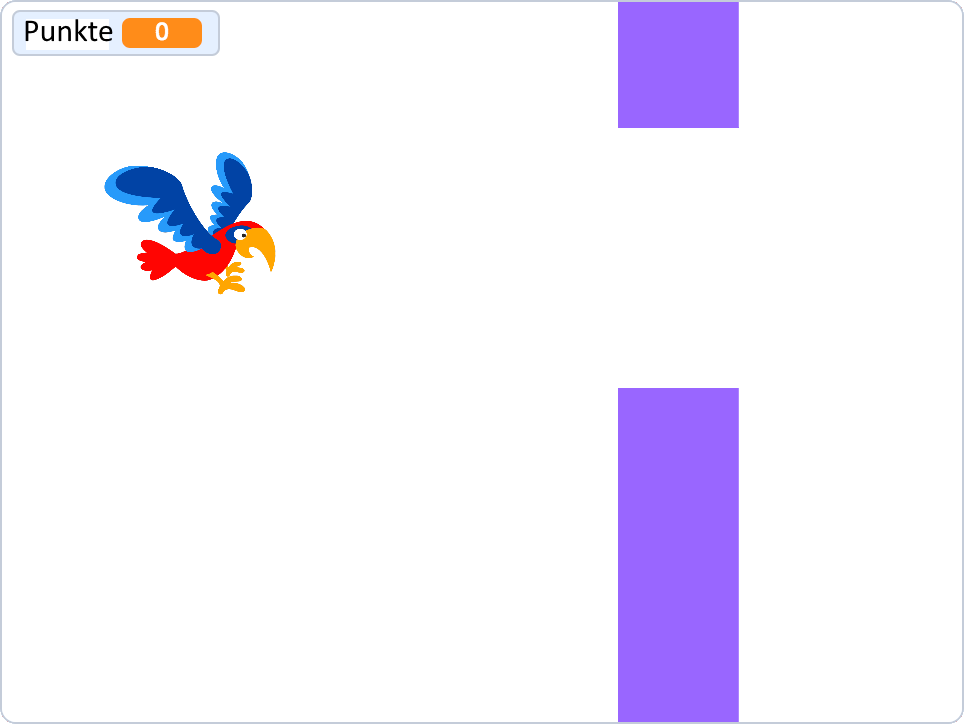
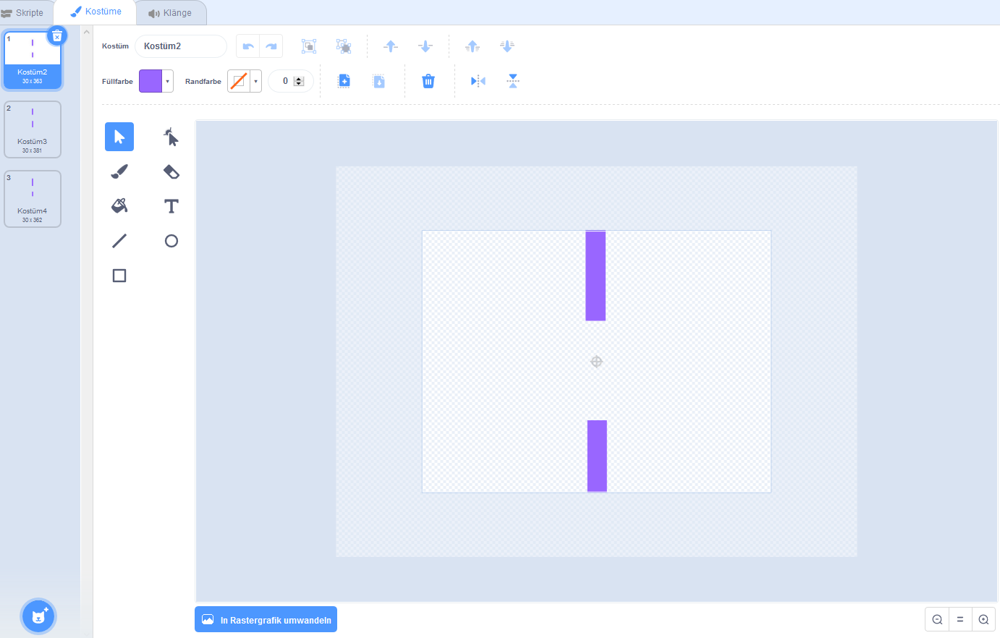
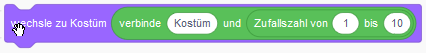
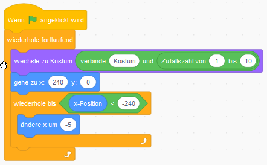
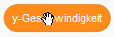
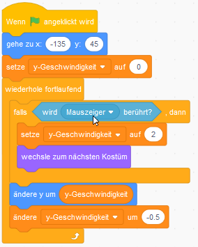
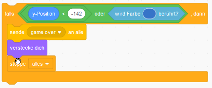
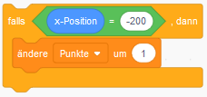

# Flappy Bird

Flappy Bird ist ein Spiel, das nicht mehr hergestellt wurde, weil die Entwickler des Spiels das Spiel für zu süchtig hielten. In Flappy Bird sollte ein Vogel zwischen zwei Röhren fliegen, ohne sie zu berühren. Es gibt immer neue Rohrpaare. Der Vogel fällt ständig nach unten, wird aber nach oben gedrückt und flattert, wenn der Spieler auf den Bildschirm klickt. Wenn der Vogel durch ein Rohrpaar gegangen ist, erhält der Spieler einen Punkt. Wenn der Vogel die Rohre oder die Unterkante berührt, ist das Spiel beendet. Im Spiel geht es darum, so viele Punkte wie möglich zu bekommen.

## Mach die Rohre

Zeichnen Sie eine Figur für die Rohre und stellen Sie sicher, dass die Figur mehrere Abdeckungen hat, so dass sich das Loch an verschiedenen Stellen befindet.

Es ist möglich zu entscheiden, welche Kostüme verwendet werden soll. 
Wenn Sie drei Kostümen haben, die als Kostüme1, Kostüme2, Kostüme3 bezeichnet werden,
verwenden Sie 
, um eine Zufallkostüme zu erhalten.

Geben Sie den Code ein und testen Sie ihn, damit sich die Rohre von rechts nach links bewegen. Ändern Sie die Argumente, bis es gut aussieht.

## Mach den Vogel

Wählen Sie eine Figur mit zwei Kostümen oder zeichnen Sie Ihre eigene Figur.

Machen Sie einen variablen <<y-Geschw.png>>, der angibt, wie groß der Schritt sein soll, wenn sich der Computer bewegt. 
Die 

Variable sollte bei jedem Tick abnehmen, damit der Vogel nach unten beschleunigt.

Wenn der Spieler irgendwo auf den Bildschirm klickt, sollte der 
<<y-Geschw.png>> einen Wert haben, der dem Vogel einen Sprung nach oben ermöglicht.

Gib den Code ein und ändert die Parameter, bis er einwandfrei funktioniert.

## Spiel ist aus

Wenn sich der Vogel zu nahe am unteren Rand befindet oder die Rohre berührt, sollte er eine "Game over" -Nachricht senden.

Geben Sie den Code an der entsprechenden Stelle ein. Wo kann es platziert werden?

Denken Sie daran, dass Sie einen Splash beim Starten des Programms anzeigen müssen, wenn Sie ihn verbergen.

Entscheide selbst, was bei Game Over passieren wird.

## Wertung

Erstellen Sie eine Variable, um Punkte zu zählen, und setzen Sie die Punktzahl beim Programmstart auf Null.

Ziehen Sie die Röhren so, dass sie sich links vom Vogel befinden. 
Wenn sich ein Pfeifenpaar an dieser Position befindet, muss der Spieler einen Punkt bekommen, dann hat der Vogel es geschafft, an den Pfeifen vorbei zu kommen.
Sehen Sie, welche x-Koordinate die Rohre haben, und geben Sie den Code an einer geeigneten Stelle ein.

Teste dein Programm und stelle sicher, dass es einigermaßen schwierig ist.

## TO DO
- [ ] Copyright unten
- [ ] Format der Bilder
- [ ] Sie >> Du

[Copyright 2019 Malin Christersson](http://cmc.education/scratch/tasks/flappyBird.php)
• Übersetzung 2021: Johannes Döllinger, Robert Storlind
