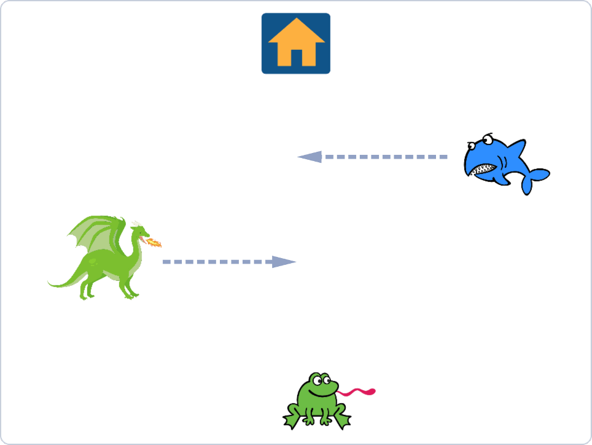
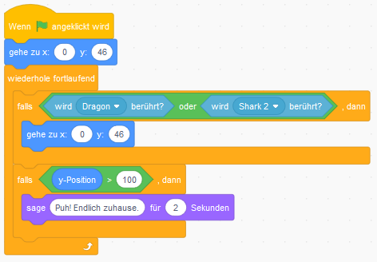

# Frogger

Frogger ist ein klassisches Spiel, bei dem ein Frosch Hindernisse überwinden muss, um nach Hause zu kommen. Hindernisse können Baumstämme sein, die in einem Fluss schwimmen, Autos, die auf einer Straße fahren, Alligatoren, die im Wasser schwimmen, oder alles andere.

Der Frosch beginnt am unteren Rand des Fensters und das Haus befindet sich am oberen Rand des Fensters. Hindernisse bewegen sich über das Fenster hin und her. Der Spieler muss das gute Zuhause steuern und Hindernissen ausweichen.

## Sprites auswählen

Wähle (oder zeichne) ein Spray, das ein Frosch sein wird. Es muss kein Frosch sein.

Wähle (oder zeichne) zwei Sprays, die Hindernisse darstellen. Diese sollten sich hin und her bewegen.

Ändert die Größen so, dass alles passt.

## Programmiere die Hindernisse
Geben Sie den folgenden Code für ein Spray ein, das ein Hindernis darstellt.

Ändern Sie `x` und `y` so, dass das Hindernis zwischen der rechten und der linken Seite gleitet.

Ändern Sie die Anzahl der Sekunden so, dass es schnell genug geht.

Geben Sie den entsprechenden Code für das zweite Hindernis ein, stellen Sie jedoch sicher, dass sich das zweite Hindernis nicht auf derselben Höhe befindet.

Wie bringen Sie die Hindernisse in verschiedene Richtungen? Wenn sich also das erste Hindernis nach rechts bewegt, bewegt sich das zweite Jahr nach links?

Testen Sie Ihr Programm! Speichern Sie Ihr Programm!

## Kontrolliere den Frosch

Der Frosch sollte erneut starten, wenn er mit dem ersten Hindernis kollidiert oder wenn er mit dem zweiten Hindernis kollidiert. Es gibt einen Block für oder in der Kategorie Operatoren.

Der Frosch muss auch in y-Richtung geführt werden. Geben Sie diesen Code für das Froschspray ein:

Testen Sie Ihren Code. Ändern Sie die y-Koordinate so, dass der Frosch von Anfang an gut platziert ist.

Ihre Sprays heißen möglicherweise nicht Dragon and Shark 2, stellen Sie sicher, dass sie richtig sind.

Stellen Sie sicher, dass es schwierig genug ist, aber dass es möglich ist, den Frosch nach oben zu lenken, ohne zu kollidieren. Ändern Sie Zeiten und Koordinaten, bis Sie zufrieden sind. Was sollten Sie tun, damit die Hindernisse schneller / langsamer werden? Wie lässt du den Frosch schneller / langsamer fahren?

## Wann ist der Frosch zu Hause?

Sie können ein Haus in einer speziellen Farbe auf den Hintergrund zeichnen und dann prüfen, ob der Frosch diese Farbe berührt, dann ist es nach Hause gekommen.

Sie können auch überprüfen, ob der Frosch hoch genug ist, indem Sie feststellen, ob die y-Koordinate groß genug ist. Sie können einen Block verwenden, um festzustellen, ob die y-Koordinate groß genug ist.

Fügen Sie den Code hinzu: 

Testen Sie Ihr Programm und entscheiden Sie, welche y-Koordinate als "home" gezählt werden soll.

Entscheide selbst, was passieren wird, wenn der Frosch nach Hause kommt.

## Erweiterung - Leben verlieren

Sie können einen variablen Lebensunterhalt verdienen. Bringen Sie das Leben auf 10, wenn das Programm beginnt. Stellen Sie sicher, dass der Frosch ein Leben verliert, wenn er mit einem Hindernis kollidiert.

Sehen Sie, ob das Leben in der Ewigkeitsschleife Null wird.

Entscheide selbst, was passieren soll, wenn das Leben gleich 0 ist.

## TO DO
- [x] Copyright unten
- [ ] Format der Bilder

[Copyright 2019 Malin Christersson](http://cmc.education/scratch/tasks/frogger.php)
• Übersetzung 2021: Johannes Döllinger, Robert Storlind
