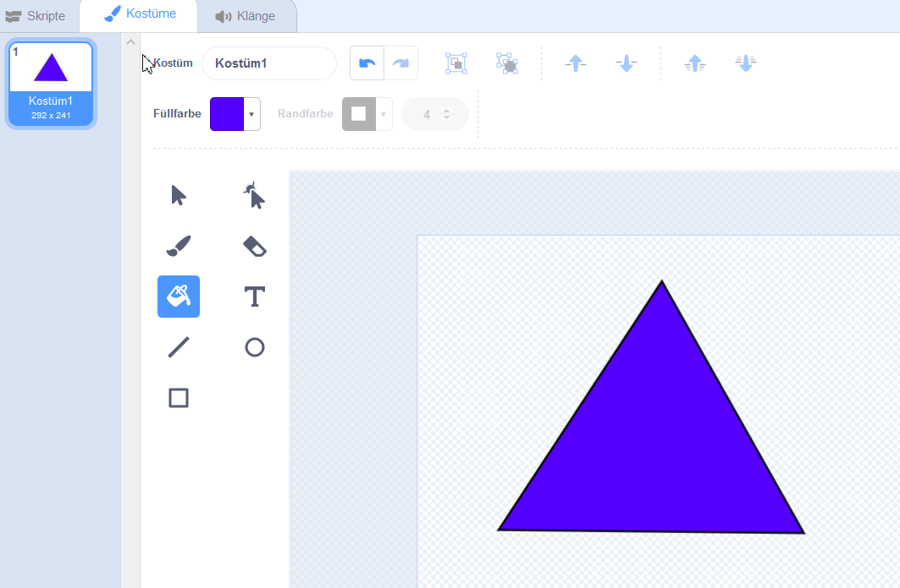
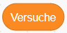

# Geometry Dash 

[Geometry Dash](https://en.wikipedia.org/wiki/Geometry_Dash) ist ein beliebtes Spiel für Handys und Tablets, das in Schweden entwickelt wurde. In dem  Spiel geht es um ein Quadrat, das über verschiedene geometrische Formen springt.  

Eure Aufgabe ist es, eine einfache Variante von Geometry Dash in Scratch zu erstellen.  

## Die Struktur des Programms  

Zeichnet drei Figuren.
- Eine Figur ist ein **Quadrat**. Das Quadrat sollte springen, wenn der Spieler auf das Feld klickt.

- Eine Figur ist ein **Dreieck**. Die Form sollte drei verschiedene Varianten haben. Die Dreiecke sollten von rechts nach links hineingleiten. Wenn ein Dreieck den linken Rand erreicht, sollte es am rechten Rand erneut beginnen und die Variante ändern. Es sollte so aussehen, als würde es ein neues Dreieck geben.

- Eine Figur mit dem **Text** „Du hast gewonnen!“

Der Spieler muss das Quadrat über die Dreiecke springen lassen.  

Wenn das Quadrat und ein Dreieck kollidieren, sollten die Dreiecke erneut mit der ersten Variante beginnen.  

Wenn der Spieler es geschafft hat, über drei Dreiecke zu springen, wird die Meldung "Du hast gewonnen!" angezeigt.  

## Zeichne Figuren und lass das Quadrat springen  

Zeichne zunächst die drei Dreiecke!  

Das Dreieck sollte drei verschiedene Varianten haben. Klickt mit der rechten Maustaste auf das Dreieck und klickt auf kopieren, um eine neue Variante zu erstellen.

Wenn das Programm startet, sollten das Quadrat und das Dreieck angezeigt werden. Das Dreieck sollte die erste Variante zeigen. Die Meldung „Du hast gewonnen!“ sollte beim Programmstart ausgeblendet werden.  

Entwickle den Code dafür!  

Der Spieler muss in der Lage sein, das Quadrat mit der Leertaste springen zu lassen. Das Quadrat sollte sich nicht nach rechts oder links bewegen lassen, sondern nur auf und ab.  

Verwende beispielsweise den Code, der in der Programmieraufgabe Simple Jump beschrieben ist.  

## Lass das Dreieck gleiten  

Es gibt verschiedene Möglichkeiten, das Dreieck von rechts nach links zu verschieben.  

Eine Möglichkeit besteht darin, den x- Wert wiederholt zu ändern. Wenn die x-Position weit genug links ist (klein genug), sollte das Dreieck die Kostüme ändern und am rechten Rand erneut beginnen. Gib die Werte ein, die in den weißen Feldern stehen sollen.

Teste dein Programm und stelle sicher, dass du das Dreieck tatsächlich überspringen kannst!  

## Behandeln von Kollisionen 

Gib einen Code für die quadratische Form ein, der prüft, ob das Quadrat das Dreieck berührt. Wenn das Quadrat das Dreieck berührt, soll es eine Nachricht an das Dreieck senden, sodass das Dreieck auf der rechten Seite erneut beginnen kann.  

 

Denk daran, dass du dies jedes Mal überprüfen musst, wenn der Computer die nächste Position berechnet. Wie sollte der Code für das Quadrat aussehen?  

Gib einen Code ein, der bewirkt, dass das Dreieck bei einer Kollision erneut gestartet wird.  

Wenn du stattdessen Code in den Dreieckcode eingebt, um zu überprüfen, ob eine Kollision vorliegt, musst du keine Nachricht senden, sondern kannst den Code mit einer erneuten Blockierung behandeln.  

# Zählt die Anzahl der erfolgreichen Sprünge  

Erstelle eine Variable namens 

Stelle sicher, dass die Variable von allen Formen verwendet werden kann.  

Wann das Programm startet sollte 
auf Null gesetzt.  

Wenn der Spieler es geschafft hat, über ein Dreieck zu springen, sollte 
sich um eins ändern. Wo im Programm kannst du den 

Block hinzufügen? Wo im Programm stellst du sicher, dass der Spieler ohne Kollision springen konnte?  

Wenn das Quadrat mit dem Dreieck kollidiert, sollte

auf Null gesetzt. Wo im Code kannst du dies hinzufügen?  

Wenn 
gleich drei ist, hat der Spieler gewonnen. Erstelle dann die Nachricht „gewonnen“. Wo im Code kannst du dies tun?  

## Du hast gewonnen  

Wenn das Quadrat und das Dreieck die Nachricht "gewonnen" empfangen, sollten sie ausgeblendet werden.  

Wenn die Meldung „Du hast gewonnen“ die Nachricht „gewonnen“ erhält, sollte sie angezeigt werden.  

## Erweiterung: Leben oder Versuche zählen 

Du kannst eine Variable 
eingeben. 
Diese ist beispielsweise zehn, wenn das Programm gestartet wird. Stelle sicher, dass der Spieler jedes Mal ein Leben verliert, wenn das Quadrat mit dem Dreieck kollidiert. Stelle sicher, dass „Game Over“ ist, wenn 
auf Null gesunken ist. Entscheide selbst, was passieren wird, wenn es „Game Over“ ist.  

Anstatt Leben zu zählen, kannst du Versuche zählen. Gebt eine Variable 
ein, die 1 ist wenn das Programm startet. Zähle jedes Mal 
hoch, wenn das Spiel erneut beginnt. Zeige an, wie viele Versuche erforderlich waren, bis der Spieler schließlich gewonnen hat! 

[Copyright 2019 Malin Christersson](http://cmc.education/scratch/tasks/geometryDash.php)
• Übersetzung 2021: Johannes Döllinger, Robert Storlind
